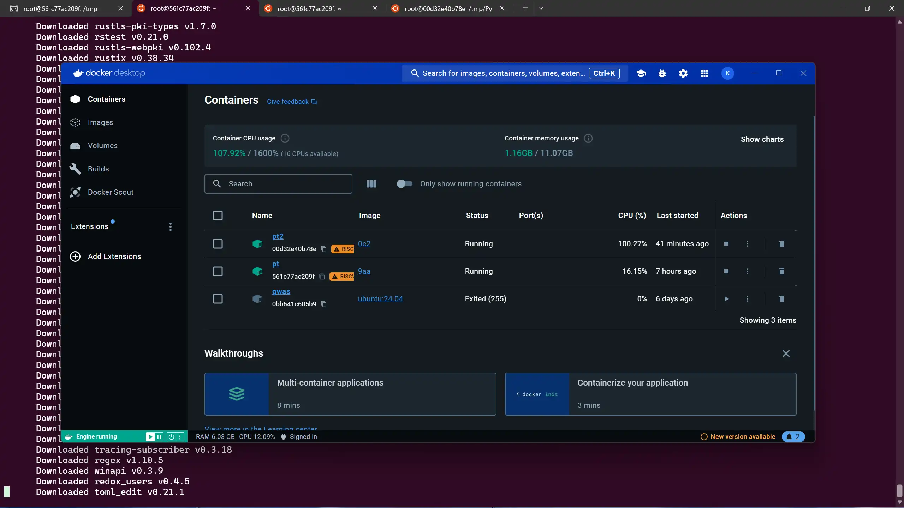
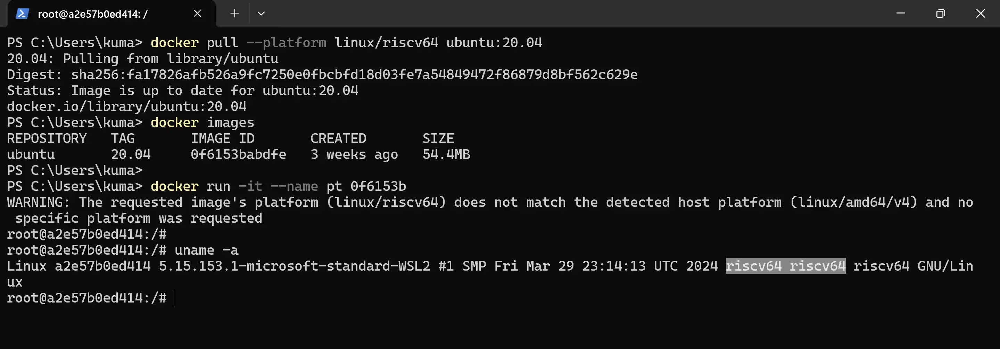

# pytorch-riscv64

[](https://github.com/KumaTea/pytorch-riscv64/releases)

[PyTorch](https://github.com/pytorch/pytorch)
wheels (whl)
for **`riscv64` / RISC-V 64 bit** devices

## Install

### pip

**`pip install torch --prefer-binary --extra-index-url https://ext.kmtea.eu/simple`**

* preferred index: **https://ext.kmtea.eu/simple**
* manually pick `whl` files: **[releases](https://github.com/KumaTea/pytorch-riscv64/releases)**

## Build

1. Install Docker Desktop on Windows

  

  You can use Dokcer for Linux, macOS or any other platforms you like.
  And Docker on Windows is likely to have more performance loss.
  Here I use it just because it configures cross compilation environment automatically.

  

2. Create Ubuntu 22.04 Image

  While the earliest version of Ubuntu that provided images for RISC-V is 20.04,
  it comes with cmake 3.16 but PyTorch requires 3.18.

  [Dockerfile](src/Dockerfile)

   ```dockerfile
   FROM --platform=linux/riscv64 buildpack-deps:jammy
   ```

3. Install Python

  From the image built above, install Python:
  [build-python.sh](src/build-python.sh)

  You can also use my prebuilt binaries:

  ```bash
  wget https://github.com/KumaTea/pytorch-riscv64/releases/download/2.4/python3.12_3.12.6+ubuntu2204_riscv64.deb
  wget https://github.com/KumaTea/pytorch-riscv64/releases/download/2.4/checkinstall_1.6.2+riscv64patched-ubuntu2204_riscv64.deb
  dpkg -i python3.12_3.12.6+ubuntu2204_riscv64.deb
  dpkg -i checkinstall_1.6.2+riscv64patched-ubuntu2204_riscv64.deb
  ```

  I must mention that `checkinstall` takes a horrible 6.5 hours to simply pack a Python installation.

4. Prepare Building Environment

  [install-deps.sh](src/install-deps.sh)

  ```bash
  python3 -m pip config set global.extra-index-url https://ext.kmtea.eu/simple

  python3 -m pip install -U pip setuptools wheel auditwheel
  python3 -m pip install -U cffi dataclasses future oldest-supported-numpy pillow pyyaml requests six typing_extensions tqdm
  ```

5. Build PyTorch

  [torch.sh](build/torch.sh)

  ```bash
  python3 setup.py build
  python3 setup.py develop
  python3 setup.py bdist_wheel
  ```

6. Audit Wheel (Optional)

  ```bash
  LD_LIBRARY_PATH=/path/to/torch/build/lib auditwheel repair dist/*.whl --plat manylinux_2_35_riscv64
  ```
